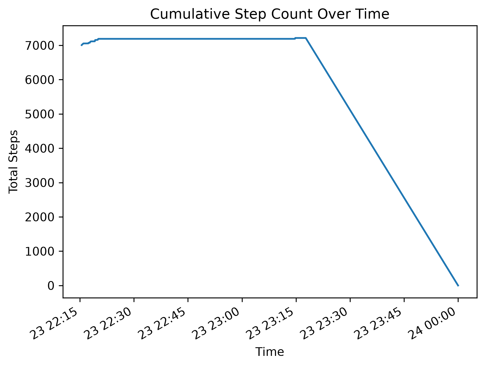
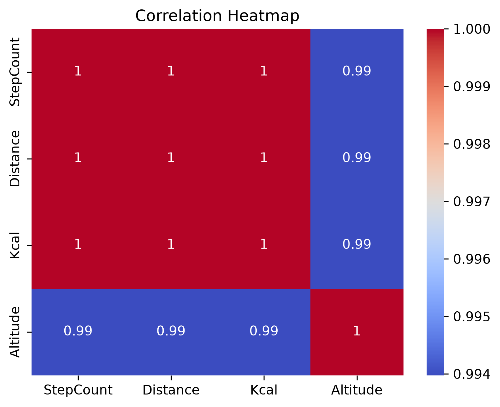

# 📊 Health App Data Wrangling

A simple data analytics project that parses raw Health App logs, cleans inconsistent records, extracts useful features, and visualizes user activity using Python.

## Tech Stack
- Python
- Pandas
- NumPy
- Matplotlib
- Seaborn
- Jupyter Notebook

## Features
- Parsed raw Health App log data
- Cleaned malformed records
- Extracted activity metrics
- Visualized user behavior and trends

## Results
- Tracked step count over time
- Calculated steps per minute
- Analyzed calorie progression
- Observed constant altitude throughout the session

## Screenshots

### Step Count Over Time

### Heatmap Over Time
